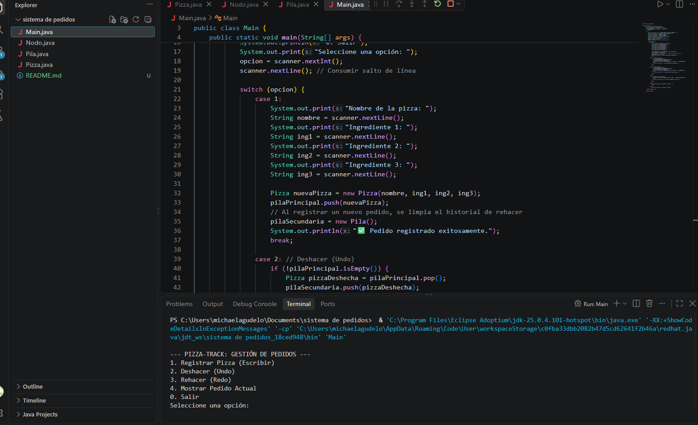
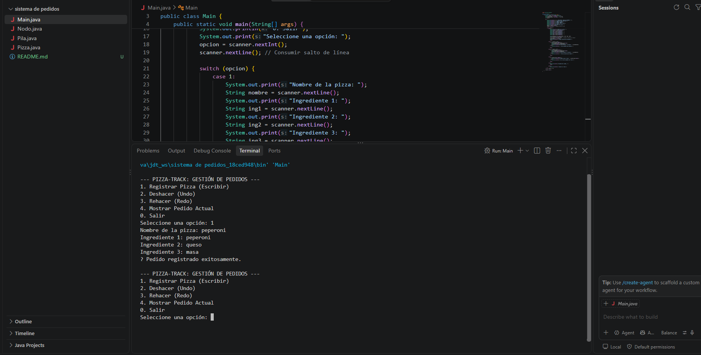
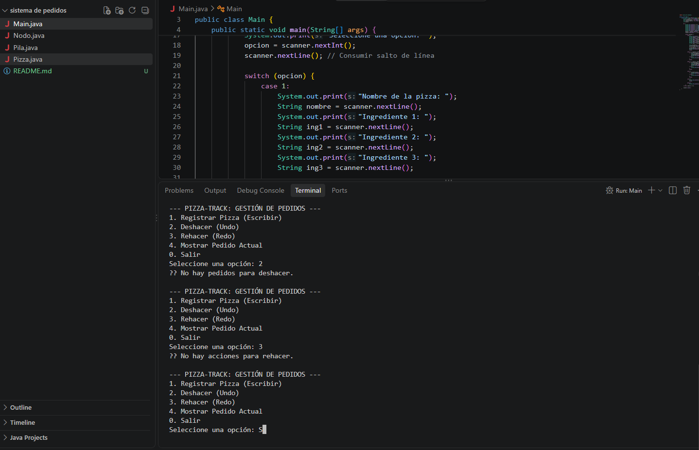

# Pizza-Track: Simulador de Gestión de Pedidos

## Objetivo
Implementar una aplicación en Java que simule el sistema de gestión de pedidos de una pizzería utilizando dos pilas manuales basadas en listas ligadas para lograr un sistema de Undo/Redo.

## Instrucciones de Ejecución
1. Asegúrate de tener instalado el JDK de Eclipse Temurin.
2. Clona este repositorio o descarga el archivo .zip.
3. Abre la carpeta del proyecto en VS Code.
4. Compila y ejecuta el archivo `Main.java` desde la terminal integrada.

## Capturas de Pantalla
## Capturas de Pantalla

**1. Registro de un nuevo pedido:**

**2. Funcionamiento de Undo (Deshacer):**

**3. Funcionamiento de Redo (Rehacer):**

## Sustentación Individual
**Estudiante: Michael Agudelo Sanchez
